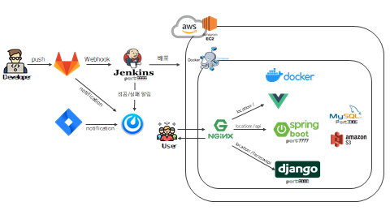
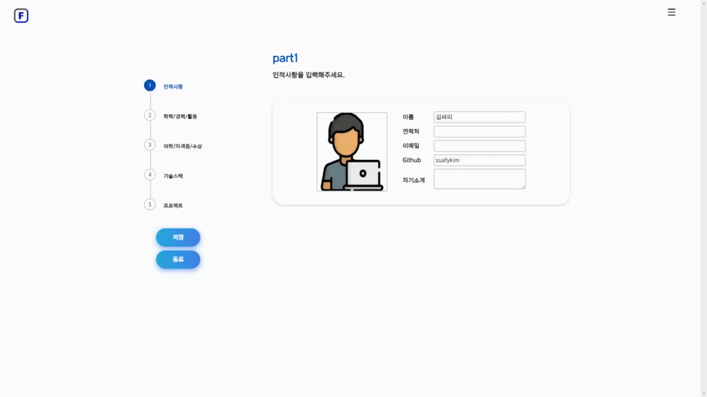
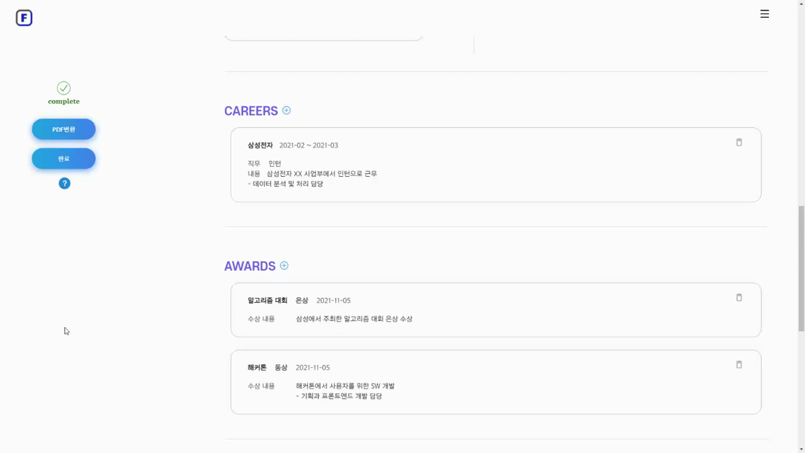
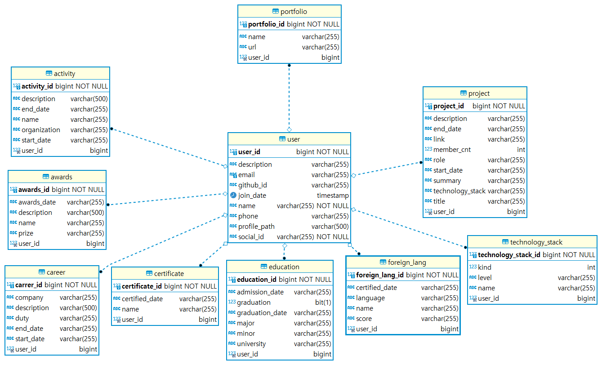
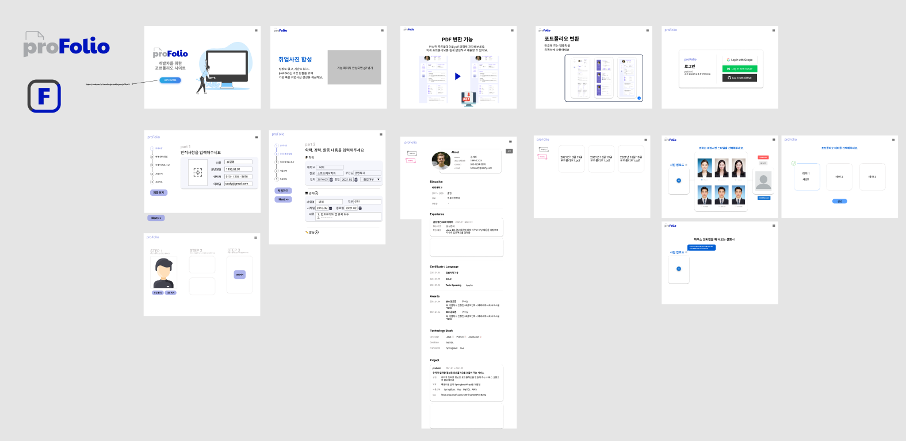
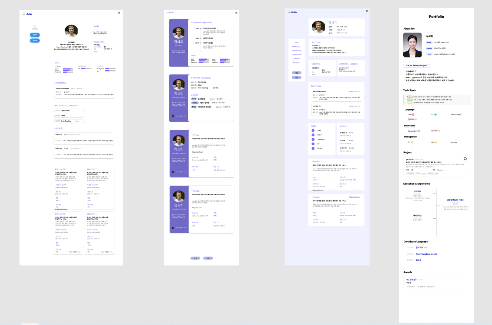

  

   
  

# proFolio | 프로폴리오 📝

- #### 서비스명 : proFolio 프로폴리오
- #### 개발기간 : 2021.10.12 ~ 2021.11.19 (6주)

 

# 📌서비스 소개

### proFolio란?

- <b>IT 입문자들을 위한 포트폴리오</b> 작성 가이드를 제공하는 웹 서비스
- 본인의 이력(학력, 자격증, 프로젝트 내용 등)을 작성한 후, <b>테마를 선택하면 포트폴리오로 변환</b>해주는 서비스 제공
- 취업 사진이 없는 지원자를 위한 <b>취업용 사진 합성 서비스</b> 제공
   

### 기획배경

- 최근 개발자의 실력과 경험을 파악하기 위해 포트폴리오 제출을 요구하는 기업이 늘어남에 따라 지원자는 경쟁력 있고 완성도가 높은 포트폴리오를 구성해야 한다.
- IT 입문자들이나 포트폴리오 작성 경험이 없는 지원자들은 포트폴리오 작성법, 들어가야 하는 내용을 잘 알지 못해 어려움을 겪고 있어 프로폴리오 서비스를 기획하게 되었다.
- 포트폴리오 서비스 뿐만 아니라 취업에 필요한 취업용 사진 합성 서비스를 제공한다.

 

# 🎬 UCC 영상
<https://youtu.be/anClEBAousY>

 

# 👩 팀원 역할
| 팀원 | 역할 | 담당 업무
| ------ | ------ | ------ |
| 이수정 | 팀장 | 백엔드 개발, CI/CD |
| 고동건 | 팀원 | 프론트엔드 개발, Django 개발 |
| 김하정 | 팀원 | Full Stack 개발 |
| 엄재식 | 팀원 | 프론트엔드 개발 |
| 전혜민 | 팀원 | Full Stack 개발 |

 

# 💻 기술 스택

> ### Front : Vue.js
>
> ### Back : Spring, Django
>
> ### Devops : docker, jenkins, nginx
>
> ### Server : AWS, S3
>
> ### DB : MySQL

 

# 💻 구현

### [메인화면]

> 메인페이지에서는 프로폴리오가 제공하는 서비스를 확인할 수 있습니다.

  

### [로그인]

> 많은 사람들이 사용하는 구글, 네이버 소셜 로그인을 지원하고,  
> 개발자를 위해 깃허브 계정 로그인을 지원합니다.

  

### [이력서 작성 및 수정]

- 이력서 작성
  > 단계에 맞춰 포트폴리오에 들어갈 내용을 작성합니다.  
  > 포트폴리오에 어떤 내용을 넣어야할지 모르는 IT 입문자들 혹은 포트폴리오를 처음 작성해보는 분들도 쉽게 작성이 가능합니다.

 

  
part.1 - 인적사항

> 이름, 연락처, 이메일, Github아이디, 자기소개를 입력합니다.

  
part.2 - 학력,경력,경험

> 학력, 경력, 경험 내용을 입력합니다.

  
part.3 - 어학,성적,수상

> 어학 성적, 자격증, 수상 경험을 입력합니다.

  
part.4 - 기술스택

> Language, Management, Framework 본인 기술 스택을 입력합니다.

  
part.5 - 프로젝트

> 프로젝트 내용을 입력합니다.

 

- 이력서 수정
  > 삭제하고 싶은 내용이 있거나 고쳐야할 부분이 있다면 '이력서 수정'을 통해서 가능합니다.

  

### [포트폴리오]

- 프로폴리오는 3가지의 테마를 제공합니다.
- 이력서 작성 후, 원하는 테마를 선택하면 이력서 내용에 맞춰 포트폴리오로 변환해줍니다.
- 변환된 포트폴리오 내용의 위치를 바꿀 수 있고, 내용을 추가하거나 삭제할 수 있습니다.

 

#### 1. 변환 기능

> 포트폴리오 생성을 누르면 테마를 선택할 수 있습니다.  
> 테마를 선택하면 이력서 내용에 맞춰 포트폴리오로 변환됩니다.

  

#### 2. 편집 기능

- 위치 변경
  > 내용의 위치를 드래그로 변경할 수 있습니다.

 

- 내용 삭제 및 추가
  > 편집 버튼을 눌러서, 내용을 삭제하거나 다시 추가할 수 있습니다.

  

### [pdf변환]

> 편집을 마친 포트폴리오를 pdf로 변환하여 저장할 수 있습니다.

  

### [취업사진 합성 기능]

> 사진을 업로드한 후 원하는 헤어스타일, 옷과 배경을 선택하면 취업용 증명 사진으로 변환이 가능합니다.

  

# 📝개발 규칙및 문서

  
Git 규칙

#### ✔ Branch 규칙

### `develop -> BE,FE/feat/기능명`

#### ex) FE/feat/editor

   

#### ✔ Commit 규칙

### `[ FE / BE / DEV ] [Git 컨벤션(대문자)] Commit 메시지`

#### ex) [FE] [feat] education API연결

  

  
Naming Rule

| 프론트엔드 | 백엔드                                                                                                                                     |
| ---------- | ------------------------------------------------------------------------------------------------------------------------------------------ |
|            | 클래스명 : 첫글자 대문자 + Camel case 변수 : 첫글자 소문자 + Camel case 함수명 : save, find, update, delete + 엔티티이름(Camel case) |

  
🗂 패키지 구조

- #### [Frontend](https://melodious-can-b87.notion.site/Frontend-9631e4ceab8c45eb930e285f4f177369)

- #### [Backend](https://melodious-can-b87.notion.site/Backend-b26e89cc1d60412e8d472b1dd1e55879)

  
공통 Response,Exception 문서

- #### [공통 Response,Exception](https://melodious-can-b87.notion.site/Response-Exception-88fe96c63dbc4d7d8872d3329e35cbe2)

 

# 📄 산출물

  
ERD
  
  
  

  
와이어프레임

  

  
기능명세서
  
  <h2> 📝기능명세서<https://melodious-can-b87.notion.site/c5c18834764a4d0bb76648103f079cb1> </h2>

 
