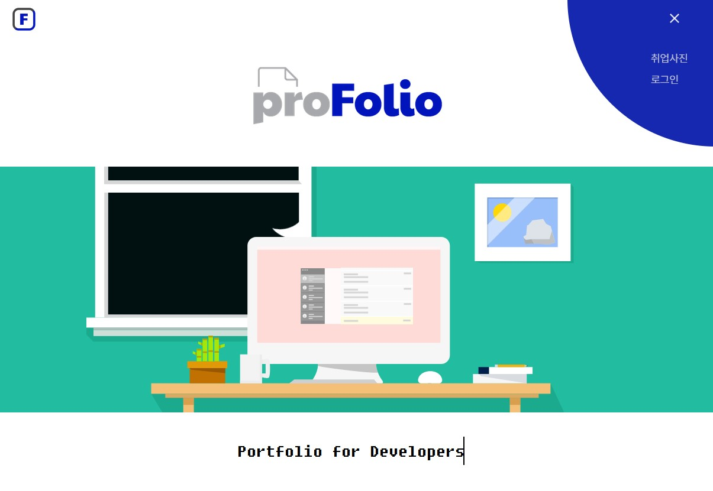
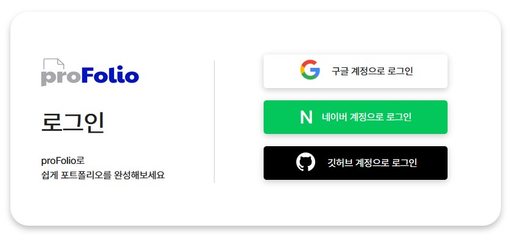
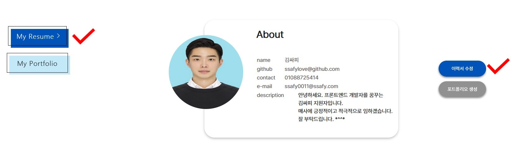
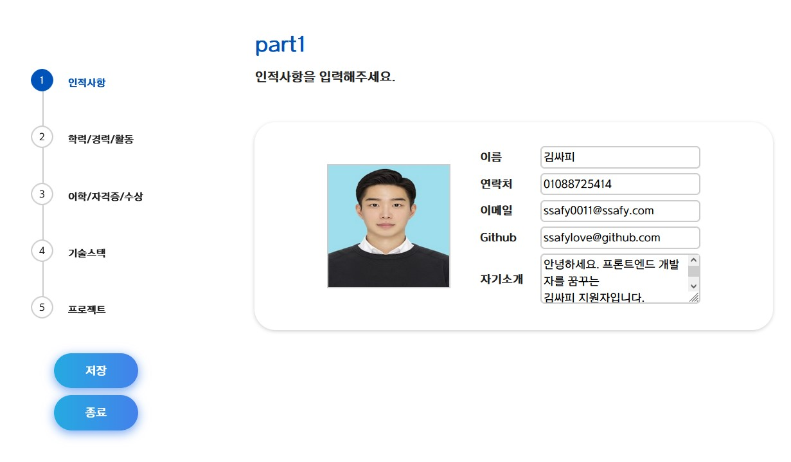
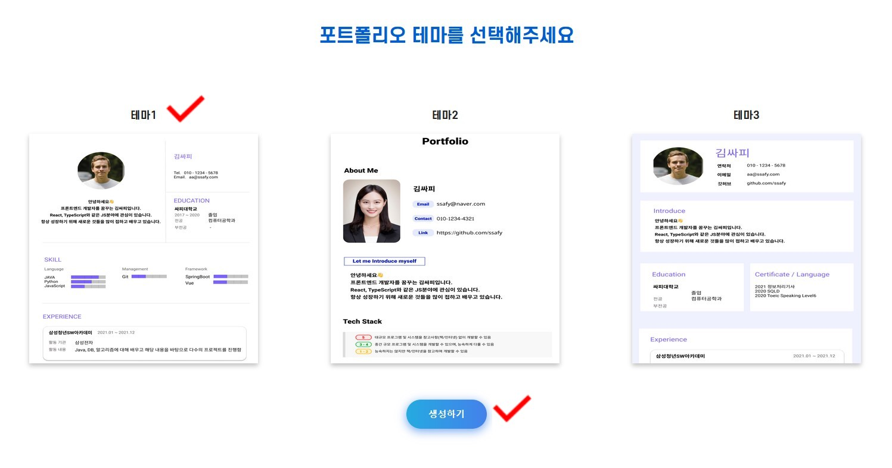
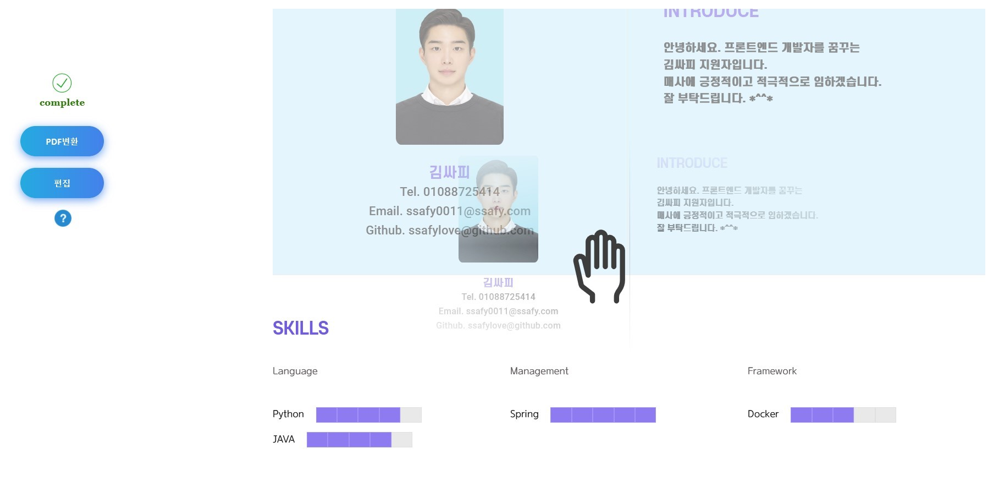
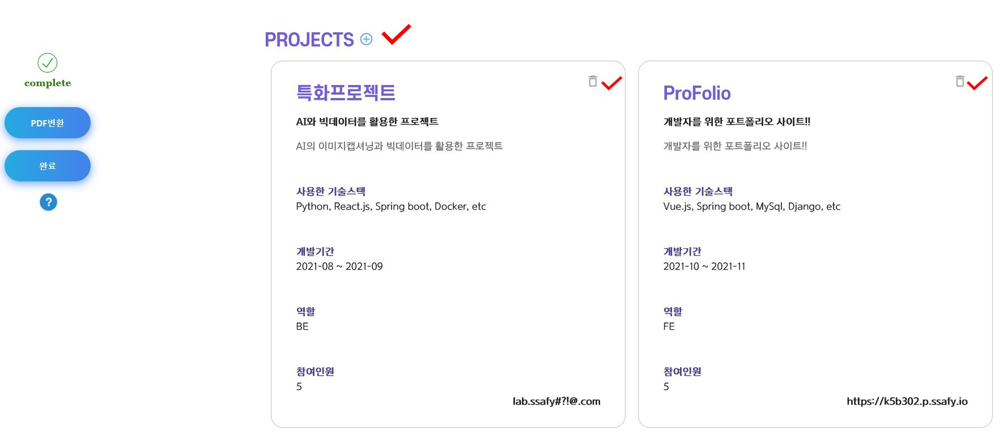
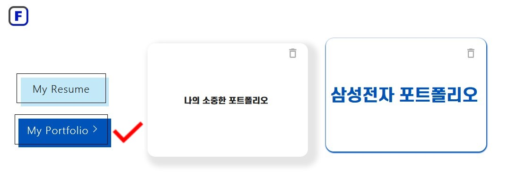
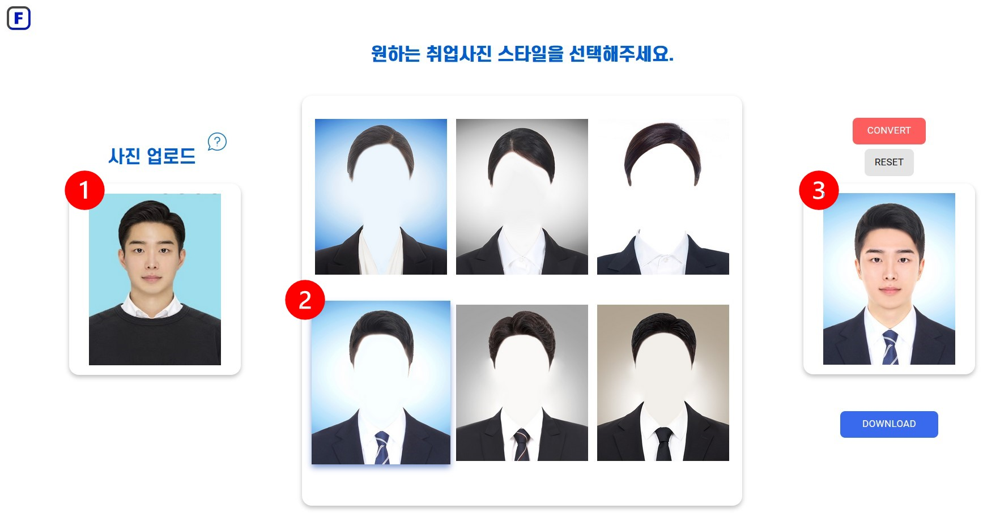

# :book: 시연 시나리오

> 
>
> 
>
> ## 1. 메인페이지
>
> 
>
> - 로그인(구글)
> - `마이페이지` 클릭
>
> 
>
> ## 2. `마이페이지`
>
>    
>
>    - ### `이력서 수정` 클릭
>
>         
>
>      1. 각 항목 입력
>      2. `종료` 클릭
>       3. 이력서 수정 확인
>
>    - ### `포트폴리오 생성` 클릭
>
>      
>
>      
>
>      
>
>      1. 테마 선택
>      2. `편집`  클릭
>      3. 편집 드래그 기능 확인
>      4. 수상, 프로젝트 항목 삭제 및 추가 확인
>      5. `완료` 클릭
>      6. PDF 변환
>      7. 파일 이름 생성 후 저장
>
> 
>
> ## 3. `마이페이지 `
>
>    
>
> 1. `My Portfolio`
> 2. 클릭저장된 포트폴리오 확인
>
> 
>
> ## 4. `메인페이지`
>
>    
>
> 1. 취업사진 클릭
>
>   2. `사진 업로드` 
>    3. 원하는 취업사진 스타일 6종 중 택 1
>   4. `CONVERT` 클릭
>    5. `RESET` 클릭하여 취업사진 재생성
>   6. `DOWNLOAD `  클릭 후 다운로드 확인

